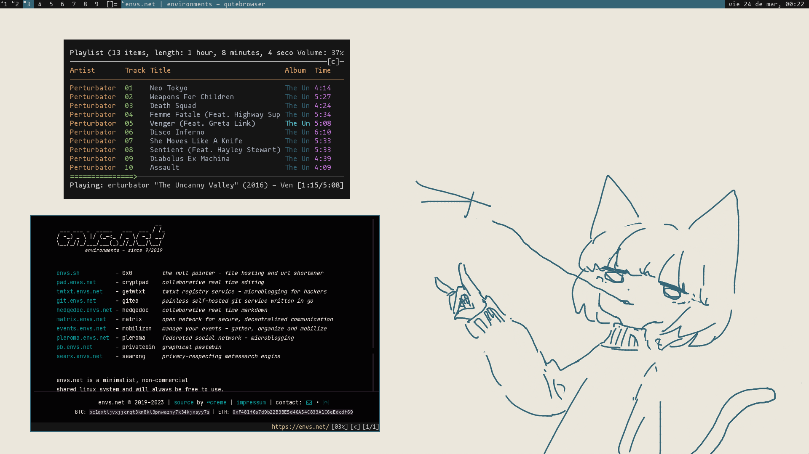

# ~ .dotfiles ~
*Archivos de configuración de mi sistema y otros cosos de interés*

## Información+
- Distro: `Pop!_OS`
- DE/WM: `herbstluftwm`
- Terminal: `st`
- Shell: `bash`
- Editor: `neovim`
- Navegador: `librewolf`, `firefox`, `qutebrowser`, `vimb`
- Fuente: `mononoki (Nerd Font)`
- Musica: `spotify`, `cmus`
- Notificaciones: `dunst`
- Tema GTK: `Juno ocean`
