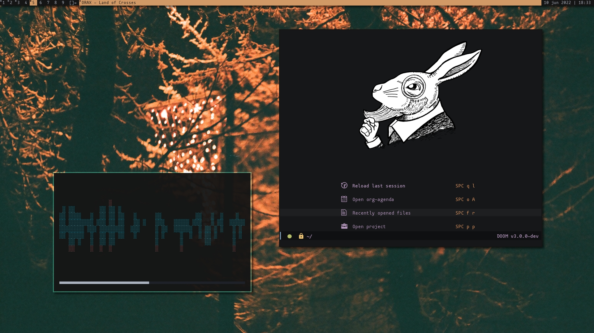

# ~ .dotfiles ~
*Archivos de configuración de mi sistema y otros cosos de interés*

## Información
- Distro: `Pop!_OS`
- Terminal: `kitty`
- Shell: `bash`
- Editor: `neovim`, `emacs`
- Navegador: `firefox`, `qutebrowser`
- Fuente: `mononoki`, `Fira Code`
- Tema GTK: `Everforest Dark`, `Juno ocean`
- WM: `dwm`
- Notificaciones: `dunst`
